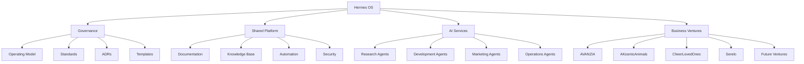

# Hermes OS System Map

> High-level map of the Hermes OS ecosystem.

## Ecosystem Overview

## Repository Responsibilities

| Repository | Purpose |
|------------|---------|
| hermes-os | Governance and shared operating framework |
| avanzia-identity | Brand identity and company assets |
| Business repositories | Individual venture implementation |

## Shared Services

- Documentation
- Standards
- Templates
- AI Governance
- Automation
- Security

## Future Additions

This map will evolve to include:

- Complete repository registry
- Agent registry
- Infrastructure diagram
- External services
- Data flows
- Security zones
- Technology stack
