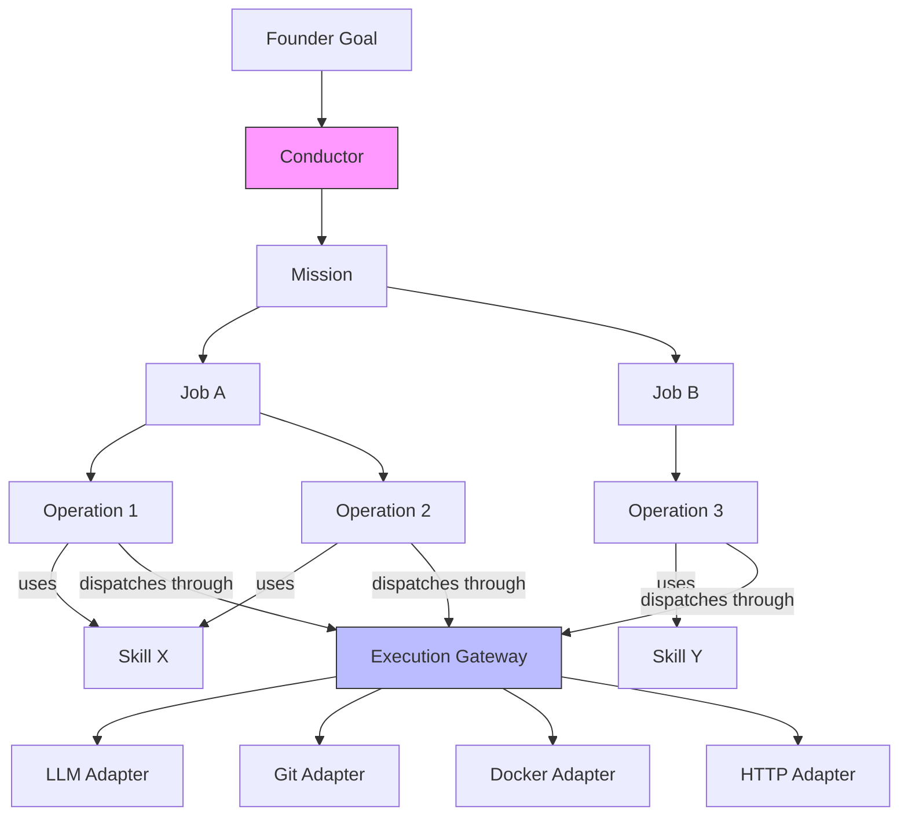
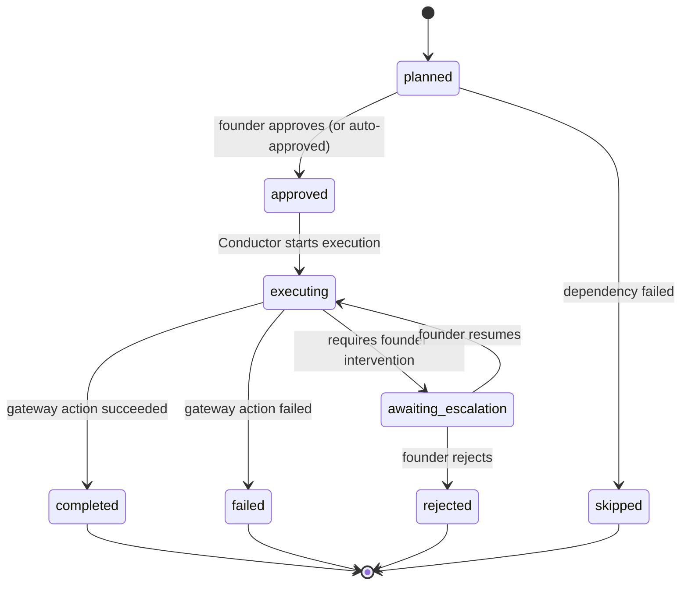
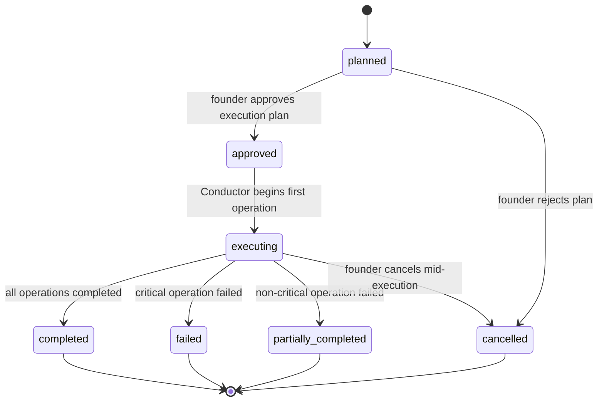
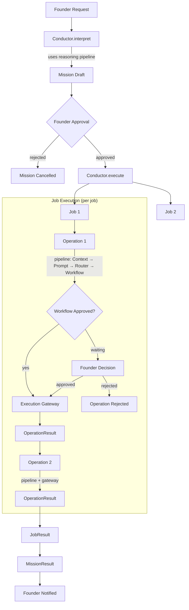
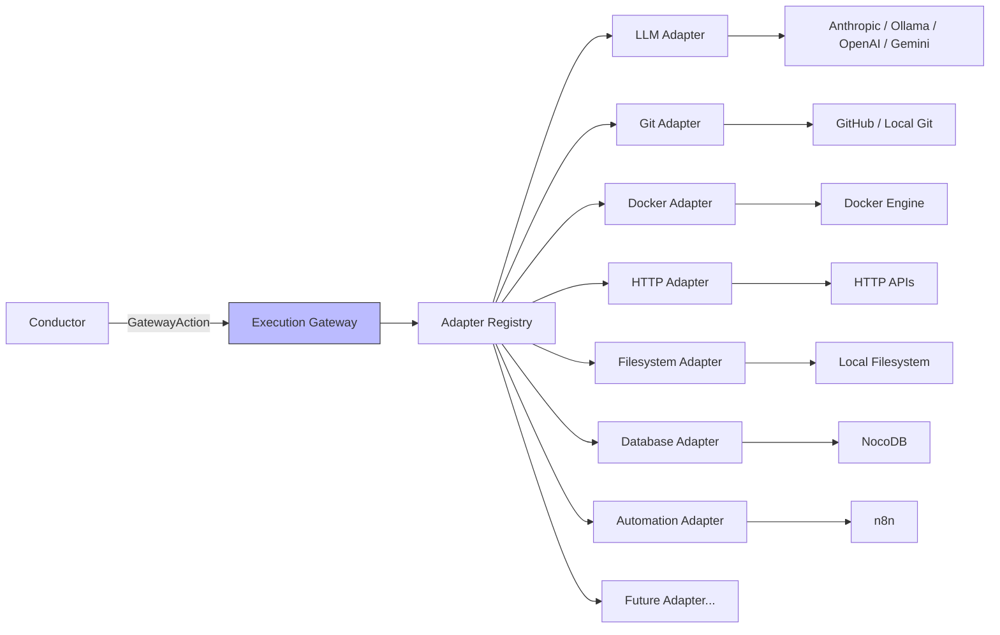
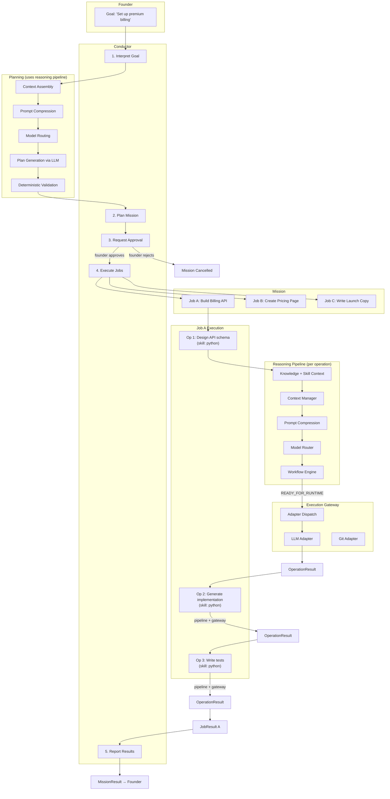
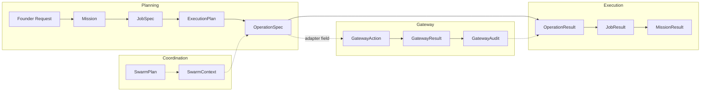

# Hermes Execution Architecture

**Milestone:** 5 — Execution Architecture
**Status:** Workshop Draft — Awaiting Founder Review
**Baseline:** Hermes OS v3.0.0 (frozen)
**Authority:** Founder

---

## Table of Contents

1. [The Central Question](#1-the-central-question)
2. [Design Constraints](#2-design-constraints)
3. [Hierarchy Derivation](#3-hierarchy-derivation)
4. [Component Definitions](#4-component-definitions)
   - [4.1 Skill](#41-skill)
   - [4.2 Operation](#42-operation)
   - [4.3 Job](#43-job)
   - [4.4 Swarm](#44-swarm)
   - [4.5 Conductor](#45-conductor)
   - [4.6 Execution Gateway](#46-execution-gateway)
5. [Execution Flow](#5-execution-flow)
6. [Typed Contracts](#6-typed-contracts)
7. [Integration with v3.0 Pipeline](#7-integration-with-v30-pipeline)
8. [Trade-offs and Alternatives](#8-trade-offs-and-alternatives)
9. [Architectural Requirements Verification](#9-architectural-requirements-verification)

---

## 1. The Central Question

**How does Hermes transform a Founder Goal into executable work?**

Today, Hermes has a complete pipeline from founder request to LLM response:

```
Request → Knowledge → Context → Prompt → Router → Workflow → Runtime
```

This pipeline processes **one request** and produces **one response**. It is stateless, deterministic, and single-turn. It answers the question "What should I say?" but not "What should I do?"

The gap: a founder goal like *"Set up premium billing"* is not a prompt — it is a multi-step undertaking that requires decomposition into work units, coordination of multiple capabilities, external system interactions, and progressive reporting. The execution architecture bridges this gap.

The answer, in one sentence: **The Conductor decomposes a founder goal into a Mission, plans Jobs that use Skills, drives Operations through the reasoning pipeline and Execution Gateway, and aggregates results back to the founder.**

---

## 2. Design Constraints

The execution architecture must respect the frozen v3.0 baseline:

1. **The reasoning pipeline is unchanged.** Knowledge → Context → Prompt → Router → Workflow is called, not modified.
2. **Determinism is preserved.** Every kernel component remains deterministic. Statefulness lives in the execution layer above the kernel.
3. **Provider independence is preserved.** The execution layer never references provider names. It operates on abstract capabilities and typed contracts.
4. **The filesystem registry model is extended, not replaced.** Skills, SOPs, and capabilities remain YAML on disk.
5. **Human authority is enforced.** High-stakes work requires founder approval at the plan level, not just the model-routing level.

**What already exists and must be preserved:**

| Existing Component | Status | Integration |
|-------------------|--------|-------------|
| `Operation` model (lifecycle: created → executing → completed/failed/rejected) | Retained | Extended with execution metadata |
| `Job` model (operation_id, completed_steps, generated_output) | Retained | Extended with planning metadata |
| `Capability` model (keywords, sop_refs, repository_refs) | Retained | Unchanged |
| `ExecutionPlan` / `ExecutionStep` models | Retained | Formalized |
| `ExecutionResult` model | Retained | Extended with gateway audit |
| `CapabilityRegistry` (keyword matching, fallback to kernel) | Retained | Unchanged |
| `SkillManifest` (skill.yaml on disk) | Retained | Extended with execution declarations |
| `SOP` / `SOPStep` models | Retained | Used by operations |
| `ContextEngine` (pipeline integration) | Retained | Called by Conductor |

---

## 3. Hierarchy Derivation

The hierarchy is not assumed — it is derived from the question "What transforms a goal into execution?" by progressively answering what is needed at each level of abstraction.

### Derivation

**Level 0: The founder has a goal.**
"Set up premium billing." This is strategic. It has no executable form. Something must interpret it.

**Level 1: The goal becomes a Mission.**
The Conductor interprets the goal: "Implement Stripe billing integration, create pricing page, write launch copy." A Mission is the actionable scope derived from a goal. It has a success criterion and bounds what work will be done.

*Why Mission, not just "decompose into jobs directly"?* Because the founder must approve the scope before any work begins. The Mission is the unit of founder approval at the plan level. Without it, the Conductor would begin executing before the founder has seen the plan.

**Level 2: The Mission decomposes into Jobs.**
Each job is a coherent unit of work that produces a distinct outcome. "Build billing API" is a job. "Write launch emails" is a job. A job succeeds or fails as a whole.

*Why Job as the primary work unit?* Because operations in isolation are meaningless. "Generate code" means nothing without the job context of "Build billing API." The job provides purpose; operations provide execution.

**Level 3: Jobs are executed through Operations.**
Each operation is one atomic action: one trip through the reasoning pipeline, one interaction with an external system. An operation uses exactly one skill's capabilities and has a clear success/failure outcome.

*Why not execute jobs directly?* Because a job may require multiple skills, multiple LLM calls, and multiple external interactions. The operation is the unit of atomicity — the smallest thing that can succeed or fail independently.

**Level 4: Operations use Skills.**
A skill is a capability package: knowledge, SOPs, tool references, and model preferences. The operation uses the skill's context when entering the reasoning pipeline. The skill tells the operation HOW to do the work; the job tells it WHAT work to do.

*Why are skills separate from operations?* Because skills pre-exist all work. The Python skill exists before anyone asks to "build billing API." Skills are installed, versioned, and discovered. Operations are transient.

**Level 5: When multiple skills must cooperate, a Swarm coordinates them.**
A swarm is a coordination pattern — not a component in the hierarchy, but a mode the Conductor enters when a job's operations span multiple skills that need shared context.

*Why not always use a swarm?* Because most jobs use one skill. A swarm adds context-sharing overhead. Simple jobs should be simple.

**Level 6: Operations interact with external systems through the Execution Gateway.**
Every operation that touches the outside world — LLM call, Git commit, Docker build, HTTP request — goes through one boundary. The gateway provides adapter isolation, audit, and failure handling.

*Why a gateway instead of direct calls?* Because every external interaction is a security boundary, a failure point, and an audit event. Centralizing them enables testing, tracing, and adapter replacement without touching the rest of the system.

### The resulting hierarchy



**Why this hierarchy and not another:**

| Alternative | Rejected because |
|-------------|-----------------|
| Flat (no jobs, just operations) | Operations need coherent grouping for failure handling, context sharing, and reporting. "Cancel remaining operations in this failed job" is a real requirement. |
| Job → Skill → Operation (skills own operations) | Skills are static capability packages. They don't "run" or "own" transient work. Confusing capability declaration with execution. |
| No Mission layer (goal → jobs directly) | The founder needs to approve the plan before work begins. The Mission is the approval boundary. |
| Swarm as a layer (always present) | Most jobs use one skill. Mandatory coordination for single-skill work is pure overhead. |

---

## 4. Component Definitions

### 4.1 Skill

**Purpose:**
A Skill is an installable capability package. It declares what Hermes can do in a specific domain, packages the knowledge and SOPs needed to do it, and references the external tools required. A skill does not execute — it enables execution.

**Responsibilities:**
- Declare capabilities (what the skill provides)
- Package domain knowledge (SOPs, templates, guidelines)
- Declare keywords for capability matching
- Declare dependencies on other skills
- Declare required execution adapters (which gateway adapters operations using this skill will need)
- Declare model preferences (which LLM models work well for this domain)
- Version itself for compatibility tracking

**Inputs:**
- None at runtime. A skill is static data loaded from disk.

**Outputs:**
- `SkillManifest` — the parsed representation of `skill.yaml`
- Knowledge documents — domain knowledge provided to the reasoning pipeline
- SOP definitions — procedural guidance for operations

**Ownership:**
- Skills are installed by the founder or platform administrator
- The `CapabilityRegistry` indexes and discovers skills
- The Conductor selects skills when planning jobs
- Skills are filesystem-scoped: one directory per skill under `skills/`

**Lifecycle:**

```
installed → active → deprecated
              ↕
          experimental
```

Skills are installed as directories containing `skill.yaml`. The `status` field controls availability: `draft` (not indexed), `active` (available for matching), `experimental` (available but flagged), `deprecated` (available but discouraged). Skills are never deleted — they are deprecated. The filesystem is the registry.

**Packaging:**
```
skills/{skill-id}/
  skill.yaml          # manifest (required)
  sops/               # standard operating procedures (optional)
    *.md
  knowledge/          # domain knowledge (optional)
    *.md
  templates/          # output templates (optional)
    *.*
```

**Versioning:**
Skills use semantic versioning in the `version` field of `skill.yaml`. The version is declarative — it is not enforced by the registry. The founder controls versioning through file edits.

**Capability declaration:**
Each skill declares a `capabilities` list — string identifiers for what it provides. These are the values the `CapabilityRegistry` indexes. A capability ID is unique across all skills (first-manifest-wins in the current registry).

**Dependencies:**
`depends_on` lists other skill IDs. Dependencies are informational — the Conductor uses them during planning to ensure prerequisite skills are available. The registry does not enforce dependency resolution at index time.

**Execution adapter declaration (new):**
```yaml
execution:
  adapters:
    - llm          # needs LLM for generation
    - git          # needs Git for code operations
    - filesystem   # needs filesystem for file creation
```

This declares which Execution Gateway adapters operations using this skill will require. The Conductor validates adapter availability during planning.

**Relationships:**
- Consumed by: `CapabilityRegistry`, `ContextManager`, `Conductor`
- References: SOPs, repositories, workflows, tables, models
- Depends on: other skills (informational)

**Extension points:**
- New skills are added by creating a directory with `skill.yaml`. No code changes.
- New capability types are added by using new capability ID strings. No enum required.
- New execution adapters are declared in `execution.adapters`. The Conductor validates against the gateway's adapter registry.

**What a Skill explicitly does NOT do:**
- Execute anything
- Own runtime state
- Make decisions
- Select models
- Interact with external systems
- Manage its own lifecycle transitions

---

### 4.2 Operation

**Purpose:**
An Operation is the atomic unit of tracked, lifecycle-bound execution. It represents one action that uses one skill's capabilities, passes through the reasoning pipeline once, and optionally dispatches one action through the Execution Gateway. An operation either fully succeeds or fully fails.

**Responsibilities:**
- Track execution lifecycle (planned → approved → executing → completed/failed)
- Record the skill used, the gateway action dispatched, and the result received
- Carry enough context to reconstruct what happened (audit)
- Feed its result into subsequent operations (for jobs and swarms)

**Inputs:**
- `OperationSpec` — the operation's definition from the execution plan
- Skill context — knowledge and SOPs from the selected skill
- Accumulated context — results from prior operations in the same job

**Outputs:**
- `OperationResult` — outcome, artifacts produced, context additions for downstream operations

**Ownership:**
- Created by: the Conductor during job planning
- Owned by: the parent Job
- Executed by: the Conductor (which drives pipeline + gateway)
- Stored by: `OperationStore`

**Lifecycle:**



This extends the existing `Operation` lifecycle (which has `created → executing → completed | awaiting_escalation | failed`, `awaiting_escalation → executing | rejected`) with `planned`, `approved`, and `skipped` states. The existing terminal states (`completed`, `failed`, `rejected`) are preserved.

**Atomicity:**
An operation is strictly atomic for external actions: a Git commit either succeeds or fails; an API call either returns or errors. For generative actions (LLM output), the operation records whatever output was produced — partial output is a valid result that informs downstream operations.

**Determinism:**
The operation's trip through the reasoning pipeline is deterministic (same context → same prompt → same routing → same workflow). The gateway action's result is not deterministic (external systems are inherently non-deterministic). The Conductor treats operation results as external input, preserving the determinism boundary at the pipeline level.

**Relationships:**
- Belongs to: one Job
- Uses: one Skill
- Dispatches through: Execution Gateway (optional — some operations are purely generative)
- Follows: one SOP (optional)
- References: `RoutingDecision`, `FounderWorkflow` from its pipeline traversal

**Extension points:**
- New operation statuses: extend the lifecycle state machine and transition rules
- New SOP types: operations follow SOPs declaratively; new SOP formats require only parser changes

**What an Operation explicitly does NOT do:**
- Decompose itself into sub-operations
- Select which skill to use (the Conductor selects)
- Call external systems directly (dispatches through the gateway)
- Modify the reasoning pipeline
- Own state beyond its own lifecycle

---

### 4.3 Job

**Purpose:**
A Job is a coherent unit of work that produces a distinct outcome. It groups a sequence of operations that together achieve one goal within a Mission. A job succeeds when all its required operations complete successfully. A job fails when any critical operation fails.

**Responsibilities:**
- Own an ordered sequence of operations with declared dependencies
- Track aggregate progress (operations completed / total)
- Handle operation failure (skip dependent operations, report partial results)
- Maintain job-level context that all operations within the job share
- Provide the approval boundary for operation-level work

**Inputs:**
- `JobSpec` — the job definition produced by the Conductor during mission planning
- Selected skills — the skills chosen by the Conductor for this job's operations

**Outputs:**
- `JobResult` — aggregate outcome, per-operation results, artifacts produced

**Ownership:**
- Created by: the Conductor during mission planning
- Owned by: the parent Mission
- Executed by: the Conductor (operation by operation)
- Stored by: `JobStore`

**Lifecycle:**



**Do Jobs call Skills?**
No. Jobs do not call skills. Jobs own operations, and operations use skills. The distinction matters: the job defines WHAT needs to happen; the skill provides HOW. The Conductor connects them during planning.

**Do Jobs own Operations?**
Yes. A job owns its operations. Operations exist within a job scope. An operation cannot belong to multiple jobs. When a job is cancelled, its pending operations are skipped.

**How do Jobs terminate?**
A job terminates when:
- All operations complete → `completed`
- A critical operation fails → `failed` (remaining operations are skipped)
- A non-critical operation fails but the rest complete → `partially_completed`
- The founder cancels → `cancelled` (remaining operations are skipped)

The Conductor determines which operations are critical based on the dependency graph — an operation is critical if any downstream operation depends on it.

**Relationships:**
- Belongs to: one Mission
- Owns: one or more Operations
- Uses: one or more Skills (via its operations)
- May use: a Swarm (when multi-skill coordination is needed)
- Produces: `JobResult`

**Extension points:**
- New job types: the `JobSpec` contract is extensible via `constraints`
- New termination policies: the criticality model can be extended (e.g., retry policies)

**What a Job explicitly does NOT do:**
- Execute operations (the Conductor does)
- Select skills (the Conductor does)
- Interact with external systems
- Own skills or capabilities
- Decompose itself into sub-jobs

---

### 4.4 Swarm

**Purpose:**
A Swarm is a coordination pattern for multi-skill jobs. When a job's operations span multiple skills that need to see each other's outputs, a swarm manages the shared context. A swarm is not a persistent entity — it is a mode the Conductor enters during execution of a specific job.

**Responsibilities:**
- Maintain a shared `SwarmContext` that accumulates operation outputs
- Define coordination points where skills must synchronize
- Ensure each operation in the swarm sees both its own skill context and the shared context
- Detect context conflicts (when two skills produce contradictory outputs)

**Inputs:**
- `SwarmPlan` — declares participating skills, shared context keys, and coordination points
- Operation results — each completed operation contributes to the shared context

**Outputs:**
- `SwarmContext` — the accumulated shared state available to all operations in the swarm

**Ownership:**
- Created by: the Conductor during job planning (when multi-skill coordination is detected)
- Owned by: the parent Job
- Managed by: the Conductor during execution
- Discarded after: the job completes

**Lifecycle:**
A swarm has no independent lifecycle. It exists for the duration of its parent job's execution.

```
Job starts → Swarm assembled (if needed) → Operations execute with shared context → Job ends → Swarm discarded
```

**What makes multiple Skills cooperate?**
Shared context. When the Conductor detects that a job's operations span multiple skills and later operations depend on earlier operations from different skills, it creates a swarm. The swarm maintains a `SwarmContext` — an append-only accumulation of operation outputs that is injected into each subsequent operation's context.

Example: "Build checkout page" requires `nextjs` (frontend), `python` (backend API), and `copywriting` (page copy). The swarm ensures that:
- The `copywriting` operation's output (page copy) is visible to the `nextjs` operation (for layout)
- The `python` operation's output (API contract) is visible to the `nextjs` operation (for data binding)

**How context is shared:**
The `SwarmContext` is append-only. Each completed operation appends its output artifacts and a structured summary. Subsequent operations receive the accumulated context as additional input alongside their skill's own context. The Conductor merges the swarm context into the operation's `ContextPackage` before entering the reasoning pipeline.

**How ownership is maintained:**
The Conductor owns the swarm. Each operation within the swarm retains its skill attribution — the swarm does not blur skill boundaries. The swarm coordinates; it does not own.

**How failures propagate:**
When an operation in a swarm fails:
- The Conductor evaluates the dependency graph
- Operations that depend on the failed operation's outputs are skipped
- Operations that do not depend on the failed output may continue
- The job's overall status reflects the failure (failed or partially_completed)

**Swarm formation rules:**
- Single-skill job → no swarm
- Multi-skill job, independent operations → no swarm
- Multi-skill job, cross-skill dependencies → swarm required

The Conductor determines swarm necessity during planning by analyzing the dependency graph for cross-skill edges.

**Relationships:**
- Belongs to: one Job
- Coordinates: multiple Skills (via their operations)
- Managed by: the Conductor
- Produces: SwarmContext (consumed by operations)

**Extension points:**
- New coordination strategies: the `SwarmPlan` can declare different context-sharing modes
- Conflict resolution policies: for when skills produce contradictory outputs

**What a Swarm explicitly does NOT do:**
- Execute operations (the Conductor does)
- Own skills or operations
- Make decisions about what to execute
- Persist beyond its parent job
- Introduce concurrency or parallelism (operations execute sequentially; the swarm manages context, not scheduling)

---

### 4.5 Conductor

**Purpose:**
The Conductor is the orchestrator that transforms a founder's request into executable work and drives it to completion. It sits above the v3.0 reasoning pipeline and calls it for each operation. It is the only component that creates Missions, Jobs, and Operations.

The Conductor is to execution what the Workflow Engine is to authorization — but while the Workflow Engine is stateless and deterministic, the Conductor is stateful and adaptive.

**Responsibilities:**
1. **Interpret** — Receive a founder request and determine what work is needed
2. **Plan** — Decompose the request into a Mission containing Jobs, select Skills, create an ExecutionPlan with ordered Operations and dependencies
3. **Approve** — Present the plan to the founder for approval before execution begins
4. **Execute** — Drive each operation through the reasoning pipeline and Execution Gateway
5. **Coordinate** — Manage swarms when multi-skill jobs require shared context
6. **Adapt** — Handle operation failures, re-plan when needed, escalate when stuck
7. **Report** — Aggregate results and report completion to the founder

**Inputs:**
- Founder request (natural language goal or directive)
- Workspace context (workspace ID, available knowledge)
- Available skills (from `CapabilityRegistry`)
- Available gateway adapters (from Execution Gateway)

**Outputs:**
- `Mission` — the planned scope of work (for founder approval)
- `JobResult` per job — individual job outcomes
- `MissionResult` — aggregate outcome across all jobs

**How the Conductor orchestrates:**



**What information the Conductor owns:**
- The current mission and its plan
- Job and operation progress
- Swarm context (accumulated operation outputs)
- Execution history (for adaptive re-planning)

**What the Conductor never owns:**
- Business knowledge (owned by Knowledge Engine)
- Prompt construction (owned by Prompt Compression)
- Model selection (owned by Model Router)
- Workflow authorization (owned by Workflow Engine)
- External system interaction (owned by Execution Gateway)
- Skill definitions (owned by the filesystem)

**Planning: deterministic vs proposal-driven**

The Conductor uses BOTH:
- **Deterministic:** Skill selection uses keyword matching via `CapabilityRegistry`. Adapter validation is deterministic. Dependency ordering is topological sort.
- **Proposal-driven:** Goal decomposition into jobs and operation definition require understanding that cannot be codified in keyword tables. The Conductor sends the founder's request through the reasoning pipeline to produce a proposed plan, then validates the plan deterministically against available skills and adapters.

This is consistent with the Hermes philosophy: *A planning component proposes; Hermes validates.* The Conductor never executes a proposed plan without deterministic validation against the capability registry.

**Ownership:**
- The Conductor is instantiated by `HermesService`
- It is the sole creator of Missions, Jobs, and Operations
- It coordinates with `OperationStore` and `JobStore` for persistence

**Lifecycle:**
The Conductor itself is stateless between missions. Mission state is serializable — a mission in progress can be paused, stored, and resumed. The Conductor reconstructs its state from the persisted mission, jobs, and operations.

**Relationships:**
- Calls: `ContextEngine`, `ModelRouter`, `WorkflowEngine`, `CapabilityRegistry`, `Execution Gateway`
- Creates: Missions, Jobs, Operations, Swarms
- Reports to: Founder (via gateway API)
- Stores through: `OperationStore`, `JobStore`

**Extension points:**
- New planning strategies: the planning phase is pluggable; different strategies for different WorkflowIntents
- New execution policies: retry, timeout, and failure-handling policies are configurable per job
- New approval modes: batch approval, auto-approval for low-risk plans

**What the Conductor explicitly does NOT do:**
- Execute gateway actions directly (delegates to Execution Gateway)
- Modify the reasoning pipeline
- Bypass founder approval
- Own business knowledge or skill definitions
- Generate text (delegates to LLM via the pipeline)
- Score or rank models (delegates to Model Router)

---

### 4.6 Execution Gateway

**Purpose:**
The Execution Gateway is the boundary between Hermes intelligence and the external world. Every operation that interacts with an external system — LLM call, Git operation, Docker command, HTTP request, file write, database query — passes through the gateway. It provides adapter isolation, audit, failure handling, and security enforcement.

**Responsibilities:**
- Maintain a registry of execution adapters
- Dispatch `GatewayAction` requests to the correct adapter
- Normalize adapter responses into a uniform `GatewayResult`
- Record every external interaction in an audit trail
- Handle timeouts, retries, and error normalization
- Validate that the requested adapter is available and healthy
- Enforce security boundaries (e.g., sandbox filesystem operations)

**How Hermes interacts with external systems without coupling:**

The gateway uses the **Adapter pattern**. Each external system type is wrapped in an adapter that implements a common interface. The gateway dispatches by adapter type — it never knows the specifics of LLM protocols, Git commands, or Docker APIs.



**Adapter interface:**

Every adapter implements:
- `adapter_type` — string identifier (e.g., `"llm"`, `"git"`, `"docker"`)
- `execute(action) → result` — dispatch one action, return one result
- `health() → status` — report adapter availability
- `capabilities() → list[str]` — what this adapter can do

**Adapter inventory:**

| Adapter | Wraps | External System |
|---------|-------|-----------------|
| `LlmAdapter` | `LlmRuntime` + provider implementations | Anthropic, Ollama, OpenAI, Gemini, OpenRouter |
| `GitAdapter` | `GitHubRuntime` | GitHub API, local Git |
| `DockerAdapter` | `DockerProvider` | Docker Engine |
| `HttpAdapter` | `httpx` | Any HTTP API |
| `FilesystemAdapter` | Sandboxed file I/O | Local filesystem |
| `DatabaseAdapter` | `NocodbRuntime` | NocoDB |
| `AutomationAdapter` | `N8nRuntime` | n8n workflows |

**Inputs:**
- `GatewayAction` — adapter type, action parameters, timeout, operation ID for audit

**Outputs:**
- `GatewayResult` — status, output, error, duration, audit ID

**Ownership:**
- Instantiated by `HermesService` at startup
- Adapters are registered at initialization from configured runtimes
- The Conductor dispatches through the gateway; it never accesses adapters directly

**Lifecycle:**
The gateway is a singleton. Adapters are registered at startup and re-registered on configuration changes. The adapter registry is the source of truth for what external interactions are available.

**Future connectors:**
Adding a new external system connector requires:
1. Implement the adapter interface
2. Register the adapter with the gateway
3. Declare the adapter type in relevant `skill.yaml` files

No changes to the Conductor, the reasoning pipeline, or any other component.

**Relationships:**
- Called by: Conductor (exclusively)
- Wraps: all existing runtime providers (`LlmRuntime`, `GitHubRuntime`, `N8nRuntime`, `NocodbRuntime`, `InfrastructureRuntime`)
- Consumed by: `OperationResult` (gateway audit recorded in result)

**Extension points:**
- New adapters: implement the interface, register with the gateway
- New action types per adapter: extend the adapter's action vocabulary
- Middleware: logging, rate limiting, circuit breaking can be inserted at the gateway level without modifying adapters

**What the Execution Gateway explicitly does NOT do:**
- Decide what to execute (the Conductor decides)
- Select which adapter to use based on content (the operation's `adapter` field is explicit)
- Modify operation context or prompt
- Own business logic
- Persist state beyond the audit trail
- Retry automatically unless explicitly configured (failure is reported to the Conductor, which decides)

---

## 5. Execution Flow

### 5.1 Complete Flow: Founder Goal to Execution Result



### 5.2 Step-by-Step Description

**Step 1 — Interpretation**
The Conductor receives the founder's request. It sends the request through the reasoning pipeline to understand intent, context, and required capabilities. The `WorkflowIntent` from the `FounderWorkflow` informs the planning strategy (EXECUTE intent triggers operational decomposition; ANALYZE intent triggers analytical decomposition).

**Step 2 — Mission Planning**
The Conductor uses the LLM (via the pipeline) to propose a decomposition into jobs. It then validates the proposal deterministically:
- Are the required capabilities available in the `CapabilityRegistry`?
- Are the required gateway adapters available?
- Are skill dependencies satisfied?
- Is the operation sequence logically consistent?

The validated plan becomes a `Mission` with `JobSpec`s and an `ExecutionPlan` per job.

**Step 3 — Founder Approval**
The Mission is presented to the founder. The founder sees: what jobs will be executed, what skills will be used, what external systems will be touched, and an estimated operation count. The founder approves, modifies, or rejects.

**Step 4 — Job Execution**
The Conductor executes jobs in the order defined by the Mission. For each job:
- Operations execute in dependency order (topological sort)
- Each operation enters the reasoning pipeline with its skill's context
- If the `FounderWorkflow` reaches `READY_FOR_RUNTIME`, the Conductor dispatches through the Execution Gateway
- The `OperationResult` is recorded and fed into subsequent operations
- If a swarm is active, the result is also appended to the `SwarmContext`

**Step 5 — Reporting**
When all jobs complete (or fail), the Conductor aggregates results into a `MissionResult` and notifies the founder. The result includes per-job outcomes, per-operation results, all gateway audit entries, and a deterministic summary.

### 5.3 Operation Execution Detail

Each operation follows this sequence:

```
1. Conductor prepares operation context:
   - Skill knowledge (from skill's knowledge/ directory)
   - Skill SOPs (from skill's sops/ directory)
   - Job context (the job's goal and constraints)
   - Accumulated context (prior operation results, swarm context)

2. Conductor invokes the reasoning pipeline:
   - KnowledgeEngine: loads skill + workspace knowledge
   - ContextManager: assembles ContextPackage
   - PromptCompression: compresses to PromptPackage
   - ModelRouter: selects model → RoutingDecision
   - WorkflowEngine: evaluates workflow → FounderWorkflow

3. Conductor evaluates FounderWorkflow:
   - READY_FOR_RUNTIME → proceed to gateway
   - WAITING_FOR_FOUNDER_APPROVAL → pause, notify founder
   - REJECTED → record failure, continue to next operation

4. Conductor dispatches through Execution Gateway:
   - Builds GatewayAction from operation spec + routing decision
   - Gateway dispatches to adapter
   - Adapter executes external interaction
   - Gateway returns GatewayResult

5. Conductor records OperationResult:
   - Status (completed / failed)
   - Output artifacts
   - Context additions (for downstream operations)
   - Gateway audit reference
```

---

## 6. Typed Contracts

### 6.1 Mission

```
Mission
  id: str                              # unique identifier
  workspace_id: str
  source_request: str                  # the founder's original request
  intent: WorkflowIntent              # from pipeline interpretation
  jobs: list[JobSpec]                  # planned jobs
  status: MissionStatus               # planned | approved | executing
                                      # | completed | failed | cancelled
  approval_status: ApprovalStatus     # pending | approved | rejected
  created_at: datetime
```

`MissionStatus`: `PLANNED` · `APPROVED` · `EXECUTING` · `COMPLETED` · `FAILED` · `CANCELLED`

---

### 6.2 JobSpec

```
JobSpec
  id: str
  mission_id: str
  workspace_id: str
  goal: str                            # what this job achieves
  required_capabilities: list[str]     # capability IDs needed
  selected_skills: list[str]           # skill IDs chosen by Conductor
  execution_plan: ExecutionPlan        # ordered operations
  priority: JobPriority                # critical | normal | low
  constraints: JobConstraints          # budget and quality preferences
```

`JobPriority`: `CRITICAL` · `NORMAL` · `LOW`

```
JobConstraints
  routing_policy: RoutingPolicy        # from v3.0 — BALANCED, CHEAPEST, etc.
  max_operations: int                  # upper bound on operation count
  require_approval_per_operation: bool # whether each operation needs approval
```

---

### 6.3 ExecutionPlan

Extends the existing `ExecutionPlan` model.

```
ExecutionPlan
  job_id: str
  operations: list[OperationSpec]
  dependencies: dict[str, list[str]]   # operation_id → [dependency_ids]
  execution_order: list[str]           # topologically sorted operation IDs
  swarm_plan: SwarmPlan | None         # present when multi-skill coordination needed
  requires_approval: bool              # whether the plan needs founder approval
```

---

### 6.4 OperationSpec

```
OperationSpec
  id: str
  job_id: str
  skill_id: str                        # which skill this operation uses
  description: str                     # human-readable description
  intent: WorkflowIntent              # operation-level intent
  adapter: str                         # gateway adapter type (e.g., "llm", "git")
  sop_ref: str | None                 # SOP to follow
  critical: bool                       # if true, failure stops the job
```

---

### 6.5 OperationResult

Extends the existing `ExecutionResult` model.

```
OperationResult
  operation_id: str
  job_id: str
  status: OperationStatus             # completed | failed | skipped | rejected
  outcome: str                        # human-readable outcome
  artifacts: list[str]                # file paths, URLs, IDs produced
  context_additions: dict[str, str]   # key-value pairs for downstream operations
  gateway_audit: GatewayAudit         # record of the external interaction
  routing_decision_summary: str       # which model was used
  pipeline_traversals: int            # how many times the pipeline was invoked
```

`OperationStatus`: `PLANNED` · `APPROVED` · `EXECUTING` · `COMPLETED` · `FAILED` · `SKIPPED` · `AWAITING_ESCALATION` · `REJECTED`

---

### 6.6 SwarmPlan

```
SwarmPlan
  job_id: str
  participating_skills: list[str]      # skill IDs in the swarm
  coordination_points: list[CoordinationPoint]
```

```
CoordinationPoint
  after_operation_id: str              # sync after this operation
  shared_outputs: list[str]            # output keys to share downstream
```

---

### 6.7 SwarmContext

```
SwarmContext
  job_id: str
  entries: list[SwarmContextEntry]     # append-only
```

```
SwarmContextEntry
  operation_id: str
  skill_id: str
  output_summary: str                  # structured summary of operation output
  artifacts: list[str]                 # references to produced artifacts
```

The `SwarmContext` is append-only. No entry is ever modified or removed once added. This preserves deterministic reconstruction — the context at any point equals the ordered sequence of entries from prior operations.

---

### 6.8 JobResult

```
JobResult
  job_id: str
  mission_id: str
  status: JobStatus                    # completed | failed | partially_completed
                                       # | cancelled
  operations_completed: int
  operations_failed: int
  operations_skipped: int
  results: list[OperationResult]       # per-operation results
  summary: str                         # deterministic summary
```

`JobStatus`: `PLANNED` · `APPROVED` · `EXECUTING` · `COMPLETED` · `FAILED` · `PARTIALLY_COMPLETED` · `CANCELLED`

---

### 6.9 MissionResult

```
MissionResult
  mission_id: str
  workspace_id: str
  status: MissionStatus
  jobs_completed: int
  jobs_failed: int
  job_results: list[JobResult]
  summary: str                         # deterministic summary
```

---

### 6.10 GatewayAction

```
GatewayAction
  adapter: str                         # "llm" | "git" | "docker" | "http"
                                       # | "filesystem" | "database" | "automation"
  action_type: str                     # adapter-specific (e.g., "generate", "commit", "build")
  parameters: dict[str, Any]           # adapter-specific parameters
  timeout_ms: int                      # action timeout
  operation_id: str                    # for audit trail linkage
```

---

### 6.11 GatewayResult

```
GatewayResult
  status: GatewayStatus                # success | failure | timeout
  output: str                          # adapter-specific output
  error: str | None                    # error message if failed
  duration_ms: int                     # actual execution time
  audit_id: str                        # unique audit record identifier
  adapter: str                         # which adapter was used
```

`GatewayStatus`: `SUCCESS` · `FAILURE` · `TIMEOUT`

---

### 6.12 GatewayAudit

```
GatewayAudit
  audit_id: str
  operation_id: str
  adapter: str
  action_type: str
  status: GatewayStatus
  duration_ms: int
  timestamp: datetime
```

---

### 6.13 SkillManifest (formalized)

The existing `skill.yaml` format, formalized as a typed contract:

```
SkillManifest
  id: str
  name: str
  version: str                         # semver
  status: SkillStatus                  # draft | active | experimental | deprecated
  owner: str
  department_id: str
  description: str
  capabilities: list[str]
  provides: list[str]
  keywords: list[str]
  inputs: list[str]
  outputs: list[str]
  depends_on: list[str]               # other skill IDs
  sop_refs: list[str]
  repository_refs: list[str]
  workflow_refs: list[str]
  table_refs: list[str]
  model_refs: list[str]
  execution: ExecutionDeclaration      # NEW: adapter requirements
```

```
ExecutionDeclaration
  adapters: list[str]                  # required gateway adapter types
```

---

### Contract Flow Summary



---

## 7. Integration with v3.0 Pipeline

The execution architecture sits ABOVE the v3.0 reasoning pipeline. It invokes the pipeline — it does not modify it.

### 7.1 Pipeline Invocation Points

The Conductor invokes the pipeline at two distinct phases:

**Phase 1 — Planning (once per mission)**
The Conductor sends the founder's request through the pipeline to generate a decomposition plan. A planning component proposes jobs and operations. The Conductor validates the proposal deterministically against the capability registry.

**Phase 2 — Execution (once per operation)**
Each operation enters the pipeline independently:
```
Skill knowledge injected → KnowledgeEngine
Operation context       → ContextManager  → ContextPackage
                        → PromptCompression → PromptPackage
                        → ModelRouter       → RoutingDecision
                        → WorkflowEngine    → FounderWorkflow
```

The `FounderWorkflow` determines whether the operation proceeds to the gateway.

### 7.2 Skill Context Injection

When the Conductor prepares an operation, it injects the operation's skill context into the knowledge layer:

1. The skill's `knowledge/` directory contents are loaded as `KnowledgeDocument` instances
2. The skill's SOP references are resolved to SOP content
3. Accumulated job context (prior operation results) is formatted as additional knowledge
4. Swarm context (if active) is formatted as additional knowledge

These are all injected as `KnowledgeDocument` instances into the `KnowledgeEngine`, ensuring they flow naturally through the existing `ContextManager → PromptCompression` pipeline without any pipeline modifications.

### 7.3 Workflow Intent Integration

The `WorkflowIntent` from the `FounderWorkflow` informs the Conductor's behavior:

| Intent | Conductor Behavior |
|--------|--------------------|
| `EXECUTE` | Full operational decomposition with gateway actions |
| `GENERATE` | Primarily LLM operations, minimal gateway actions |
| `ANALYZE` | Read-only operations, no destructive gateway actions |
| `PLAN` | Planning operations, output is a plan document |
| `VALIDATE` | Verification operations, may invoke test adapters |
| `REVIEW` | Read + analysis operations, no writes |
| `LEARN` | Knowledge retrieval operations, LLM-only |
| `DOCUMENT` | Generation operations, output is documentation |

### 7.4 Approval Integration

The execution architecture introduces plan-level approval that complements the existing model-routing-level approval:

| Approval Level | Owner | Trigger | Gate |
|---------------|-------|---------|------|
| Mission approval | Conductor | Before any job executes | Founder approves/rejects the plan |
| Operation approval | Workflow Engine | Per-operation, based on routing policy | `CLOUD_ONLY` / `HIGHEST_QUALITY` policies |

These are independent gates. A mission may be approved but individual operations within it may still require approval based on their routing policy.

### 7.5 Existing Component Preservation

| Existing Component | Integration |
|-------------------|-------------|
| `ContextEngine` | Called by Conductor; no changes |
| `ModelRouter` | Called per operation; no changes |
| `WorkflowEngine` | Called per operation; no changes |
| `CapabilityRegistry` | Called during planning; no changes |
| `OperationStore` | Used by Conductor for persistence; extended schema |
| `JobStore` | Used by Conductor for persistence; extended schema |
| `LlmRuntime` | Wrapped by LLM adapter in Execution Gateway |
| `GitHubRuntime` | Wrapped by Git adapter in Execution Gateway |
| `N8nRuntime` | Wrapped by Automation adapter |
| `NocodbRuntime` | Wrapped by Database adapter |
| `InfrastructureRuntime` | Wrapped by Docker/infrastructure adapters |

No v3.0 component is modified. The execution architecture extends the system by adding new components above and around the existing pipeline.

---

## 8. Trade-offs and Alternatives

### 8.1 Mission Layer: Include or Omit?

**Alternative A — No Mission layer:** The Conductor decomposes directly into Jobs. The founder approves each job individually.

**Alternative B — Mission layer (recommended):** The Conductor creates a Mission that groups related jobs. The founder approves the Mission as a whole.

**Why B:** Without a Mission, the founder must evaluate each job in isolation without seeing the complete plan. The Mission provides the coherent scope that makes plan-level approval meaningful. It also provides the natural unit for "cancel everything" when the founder changes direction.

**Trade-off:** Adds one layer to the hierarchy. Adds one contract (`Mission`). The overhead is minimal — a single-job request still creates a Mission, it just has one job.

---

### 8.2 Planning: Deterministic vs Proposal-Driven

**Alternative A — Fully deterministic:** The Conductor uses keyword tables and capability matching to decompose goals into jobs, similar to how the Workflow Engine determines intent.

**Alternative B — Proposal-driven with deterministic validation (recommended):** A planning component (currently the LLM via the reasoning pipeline, but architecturally any future planning component) proposes a decomposition. The Conductor validates the proposal deterministically against the capability registry.

**Why B:** Goal decomposition requires understanding that keyword tables cannot capture. "Set up premium billing" → "build API + create page + write copy" requires domain reasoning. The planning proposal may originate from an LLM or any future planning component — the architecture does not prescribe the proposal source.

**Trade-off:** The planning phase is non-deterministic (different proposal sources may produce different plans). However, the validation phase is deterministic, and the founder approves the plan before execution. Non-determinism is bounded and supervised.

---

### 8.3 Swarm: Entity vs Pattern

**Alternative A — First-class entity:** A Swarm is a persistent object with its own lifecycle, state machine, and persistence.

**Alternative B — Coordination pattern (recommended):** A Swarm is a mode the Conductor enters during job execution. The `SwarmPlan` is data; the `SwarmContext` is managed by the Conductor.

**Why B:** Making swarm a first-class entity adds lifecycle complexity without value. The Conductor already manages job execution — swarm coordination is a natural extension of that responsibility. A swarm's "lifecycle" is exactly its parent job's lifecycle.

**Trade-off:** If future requirements demand swarms that span multiple jobs or persist beyond job completion, the pattern approach would need to be promoted to an entity. This is an acceptable future risk — the contracts (`SwarmPlan`, `SwarmContext`) are already defined and would transfer to an entity model.

---

### 8.4 Execution Gateway: Unified vs Per-Adapter

**Alternative A — Per-adapter interfaces:** The Conductor calls `llm_runtime.generate()`, `github_runtime.commit()`, etc., directly.

**Alternative B — Unified gateway (recommended):** All external interactions pass through one `ExecutionGateway.dispatch(action)` interface.

**Why B:** A unified gateway provides: one audit trail, one security boundary, one point for timeouts and retries, one mock target for testing. Per-adapter interfaces fragment all of these concerns.

**Trade-off:** The gateway adds one level of indirection. Adapter-specific features (e.g., LLM streaming) must be exposed through the generic `GatewayAction`/`GatewayResult` interface, which may require adapter-specific result types.

---

### 8.5 Operation Execution: Sequential vs Concurrent

**Alternative A — Sequential (recommended for Milestone 5):** Operations within a job execute one at a time, in dependency order.

**Alternative B — Concurrent:** Independent operations execute in parallel.

**Why A for now:** Sequential execution preserves determinism (same order, same results), simplifies failure handling, and eliminates concurrency bugs. The architecture supports future concurrency — the dependency graph already expresses which operations are independent — but sequential execution is the safe starting point.

**Trade-off:** Sequential execution is slower for jobs with independent operations. If performance becomes an issue, the Conductor can be extended to execute independent operations concurrently without changing the contracts or the pipeline.

---

### 8.6 Context Sharing: Append-Only vs Mutable

**Alternative A — Append-only SwarmContext (recommended):** Each operation appends its output. No operation modifies previous context.

**Alternative B — Mutable shared state:** Operations can update shared state.

**Why A:** Append-only preserves deterministic reconstruction. You can always determine the swarm state at any point by replaying operations in order. Mutable state introduces ordering dependencies that are hard to debug and impossible to reproduce deterministically.

**Trade-off:** Append-only may accumulate redundant context (e.g., a later operation supersedes an earlier one). The Conductor can mitigate this by summarizing the swarm context before injecting it into the reasoning pipeline.

---

## 9. Architectural Requirements Verification

| Requirement | How Satisfied |
|-------------|---------------|
| **Deterministic** | The reasoning pipeline remains deterministic. The Conductor's planning phase is proposal-driven but validates deterministically. Execution order is deterministic (topological sort). SwarmContext is append-only. |
| **Provider-independent** | The Execution Gateway adapter pattern isolates all providers. The Conductor never references provider names. Adapters are registered by type, not by provider. |
| **Strongly typed** | All contracts are dataclasses with slots. All status codes are enums. No dict-passing across component boundaries. |
| **Declarative** | Skills are declared in YAML. Execution plans are data. Dependencies are declared, not inferred at runtime. Adapter requirements are declared in skill manifests. |
| **Testable** | The Conductor can be tested with mock gateway adapters. Each component can be tested in isolation. The pipeline is unchanged and independently testable. |
| **Composable** | Skills compose via dependencies. Jobs compose within Missions. Operations compose within Jobs. Adapters compose within the gateway. |
| **Extensible** | New skills: add directory + YAML. New adapters: implement interface + register. New planning strategies: plug into Conductor. No existing components modified. |

**Non-negotiable principles verified:**

| Principle | Status |
|-----------|--------|
| Business architecture remains permanent | Skills, capabilities, and SOPs are filesystem artifacts. The execution layer orchestrates; it does not restructure business knowledge. |
| Skills are installable capability packages | Skills are directories with manifests. They declare capabilities, package knowledge, and reference tools. They do not execute. |
| Provider names never drive orchestration | The Conductor reasons about capabilities and adapter types. The gateway resolves providers. Provider identity is invisible to orchestration. |
| Every engine communicates via typed contracts | All 13 contracts defined in Section 6 are typed dataclasses. No free-form dicts cross boundaries. |
| Runtime execution is isolated behind the Gateway | Every external interaction passes through the Execution Gateway. No component above the gateway touches an external system directly. |
| Future components require extension rather than modification | New skills, adapters, planning strategies, and approval modes are all additive. No existing v3.0 component is modified. |

---

## Document Control

| Field | Value |
|-------|-------|
| Document ID | `docs/architecture/hermes-execution-architecture.md` |
| Version | Workshop Draft |
| Milestone | 5 — Execution Architecture |
| Status | Awaiting Founder Review |
| Baseline | Hermes OS v3.0.0 (frozen) |
| Authority | Founder |
