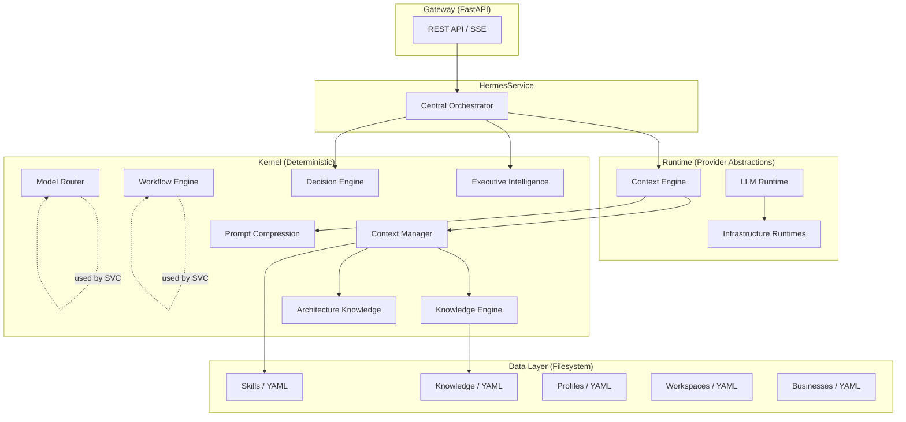
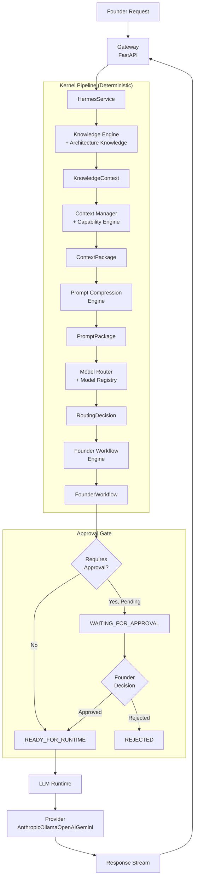
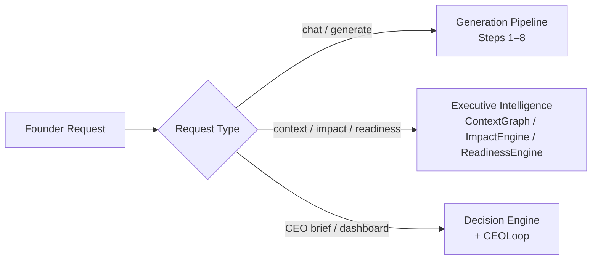

# Hermes OS v3.0 — Architecture Baseline

**Version:** 3.0.0
**Status:** Frozen
**Milestone:** 4 — Self-Hosted Intelligence
**Owner:** Founder
**Authority:** Founder approval required for changes

---

## Table of Contents

1. [Executive Summary](#1-executive-summary)
2. [Design Philosophy](#2-design-philosophy)
3. [Architectural Principles](#3-architectural-principles)
4. [Core Components](#4-core-components)
5. [Typed Contracts](#5-typed-contracts)
6. [Execution Flow](#6-execution-flow)
7. [Repository Structure](#7-repository-structure)
8. [Runtime Architecture](#8-runtime-architecture)
9. [Architectural Invariants](#9-architectural-invariants)
10. [Extension Points](#10-extension-points)
11. [Current Scope](#11-current-scope)

---

## 1. Executive Summary

Hermes OS is the Executive Operating System for AI-native companies. It transforms business knowledge into organizational intelligence, providing founders with deterministic decision support, context-aware AI generation, and executive workflow orchestration.

Version 3.0.0 completes Milestone 4 — Self-Hosted Intelligence — and establishes the full deterministic pipeline from founder request to runtime execution. This release adds four new kernel components that operate between the context layer and the LLM runtime: the Architecture Knowledge engine, the Context Manager, the Prompt Compression engine, the Model Router, and the Founder Workflow Engine.

**Milestone history:**

| Milestone | Working Title | Completion |
|-----------|--------------|------------|
| 1 | Foundation | Complete |
| 2 | Runtime Platform | Complete |
| 3 | Executive Intelligence | Complete (v2.5.0) |
| 4 | Self-Hosted Intelligence | Complete (v3.0.0) |

The canonical prior-milestone architecture document for the Executive Intelligence layer is `docs/architecture/executive-intelligence.md`. This document supersedes it as the complete system reference.

---

## 2. Design Philosophy

Three statements define how Hermes is built:

**Business architecture is permanent. Technology is replaceable.**
The data contracts, decision lifecycle, knowledge model, and execution pipeline are the durable assets. Provider integrations, model identifiers, and infrastructure choices are replaceable without changing the system's identity.

**Hermes owns intelligence. Reasoning providers supply reasoning.**
The kernel decides what context to assemble, which model to use, and whether the workflow may proceed. The LLM provider generates text. These responsibilities are strictly separated and never merged.

**Deterministic before autonomous.**
Every component in the pipeline that can be deterministic is deterministic. Same inputs always produce the same outputs. AI reasoning is injected at precisely one point — the LLM call — and nowhere else in the pipeline.

---

## 3. Architectural Principles

These ten principles are adopted from the Hermes Constitution (`docs/architecture/HERMES_CONSTITUTION.md`) and govern all architectural decisions.

1. **Business First** — Every feature must improve executive decision-making, business knowledge, execution, organizational intelligence, or portfolio value. Nothing else belongs in Hermes Core.

2. **Executive First** — Hermes is designed for the founder as primary user. All interfaces, workflows, and outputs are executive-grade.

3. **Human Authority** — The founder retains final authority over execution. High-stakes workflows require explicit approval before proceeding to runtime.

4. **Knowledge is Capital** — Business knowledge is a first-class asset, stored in structured, versioned files. The filesystem is the registry.

5. **Decisions are First-Class Objects** — Decisions are typed, tracked, audited, and actionable. They are not free text.

6. **Portfolio Thinking** — Every business operated by Hermes makes the next business easier to build. Architecture supports multi-venture operation.

7. **Deterministic Before Autonomous** — All pipeline components are deterministic by default. AI is used only where human judgment genuinely cannot be codified.

8. **Explainability** — Every output carries its reasoning. Scores, rankings, risk levels, routing decisions, and workflow transitions are all traceable to declared rules.

9. **Continuous Learning** — The system records lessons, decisions, and outcomes to improve future operation.

10. **Preserve Identity** — Hermes evolves without changing its identity. The constitution takes precedence over sprint plans, implementation convenience, and external trends.

---

## 4. Core Components

Hermes is organized into two architectural layers: the **Kernel** (deterministic intelligence) and the **Runtime** (provider abstractions and I/O). All intelligence lives in the kernel. All provider communication lives in the runtime.



### 4.1 Knowledge Engine

**Package:** `src/hermes/kernel/knowledge_engine.py`
**Class:** `KnowledgeEngine`

The Knowledge Engine loads, scores, and selects knowledge documents from the filesystem. It is the sole component that reads business knowledge from disk.

**Responsibilities:**
- Load business knowledge for a workspace from `knowledge/{project}/manifest.yaml`
- Load architecture knowledge by delegating to Architecture Knowledge
- Score documents against a query using term-frequency matching (title match = 3 pts, content match = 1 pt)
- Select the top-N most relevant documents from a scored list
- Merge business and architecture knowledge into a unified `KnowledgeContext`
- Expose architecture source metadata

**Does not own:** prompt construction, context packaging, capability matching, filesystem writes.

**Key methods:**
- `load(project_id) → KnowledgeContext`
- `load_architecture(categories) → list[KnowledgeDocument]`
- `load_with_architecture(project_id, categories) → KnowledgeContext`
- `select(documents, query, max_docs) → list[KnowledgeDocument]`

---

### 4.2 Architecture Knowledge

**Package:** `src/hermes/kernel/architecture_knowledge.py`
**Class:** `ArchitectureKnowledge`

Architecture Knowledge exposes the Hermes architecture itself as a queryable knowledge source. The system's own design documents, decisions, standards, specifications, and contracts are available as context for any request.

**Responsibilities:**
- Declare and maintain a catalog of architecture source categories
- Load documents from declared category directories
- Assign structured document IDs (`arch:{category}:{stem}`)
- Expose category metadata for discovery

**Architecture source catalog:**

| Category | Directory | Pattern | Description |
|----------|-----------|---------|-------------|
| `architecture` | `docs/architecture` | `*.md` | Architecture documents |
| `governance` | `docs` | `*.md` | Governance documents |
| `decisions` | `decisions` | `*.md` | ADRs and governance decisions |
| `standards` | `standards` | `*.md` | Engineering standards |
| `specifications` | `specs` | `*.md` | Business object specifications |
| `contracts` | `contracts` | `*.schema.json` | Canonical JSON Schemas |

**Does not own:** document scoring, selection, or context assembly.

---

### 4.3 Context Manager

**Package:** `src/hermes/kernel/context_manager.py`
**Class:** `ContextManager`

The Context Manager produces a typed `ContextPackage` for a given request. It is the boundary between raw knowledge and structured context. It is deterministic: same query and workspace always produce the same package.

**Responsibilities:**
- Execute a 7-step assembly algorithm: load knowledge → score documents → apply category boosts → sort → match capabilities → build references → compute budget
- Apply architecture category boosts when query terms match domain keywords (+2.0 to architecture documents in matching categories)
- Match capabilities from the Capability Registry against the query
- Build typed `KnowledgeReference` and `CapabilityReference` objects
- Compute a `TokenBudget` describing the assembled context

**Category boost domains:** `architecture`, `decisions`, `standards`, `specifications`, `contracts`, `governance`.

**Does not own:** prompt construction, model selection, filesystem access, LLM calls.

**Key method:**
- `assemble(query, workspace_id, max_knowledge, max_capabilities) → ContextPackage`

---

### 4.4 Prompt Compression Engine

**Package:** `src/hermes/kernel/prompt_compression.py`
**Class:** `PromptCompression`

The Prompt Compression Engine transforms a `ContextPackage` into a `PromptPackage`. It fits assembled context into a declared token budget using a priority-ordered truncation algorithm. All decisions are algorithmic — no AI summarization, no embeddings.

**Responsibilities:**
- Accept a character budget (preset or integer)
- Render context into ordered sections
- Truncate lower-priority sections first to fit the budget
- Record every omission with a typed `OmissionReason`
- Produce a `TruncationReport` with full utilization metrics

**Budget presets:**

| Preset | Character Limit |
|--------|----------------|
| `"4k"` | 12,000 |
| `"8k"` | 28,000 |
| `"16k"` | 56,000 |
| `"32k"` | 112,000 |

**Section order (always rendered in this sequence):**
`header` → `architecture` → `business_knowledge` → `capabilities` → `contracts` → `standards`

**Truncation priority (lowest truncated first):**
`standards` (40) → `contracts` (50) → `business_knowledge` (60) → `capabilities` (70) → `architecture` (80) → `header` (100, never truncated)

**Does not own:** context assembly, model selection, LLM calls, AI summarization.

**Key method:**
- `compress(package, documents, budget) → PromptPackage`

---

### 4.5 Model Router

**Package:** `src/hermes/kernel/model_router.py`
**Class:** `ModelRouter`

**Registry:** `src/hermes/kernel/model_registry.py`

The Model Router deterministically selects a model from the registry for a given prompt and routing policy. It never executes inference. It reasons about abstract `ExecutionCapability` values — never about provider names or provider-specific attributes.

**Responsibilities:**
- Filter models by availability and context window fit
- Apply hard policy constraints (CLOUD_ONLY, LOCAL_ONLY)
- Score all eligible models on a 0–100 scale
- Select the primary model and up to N fallbacks
- Record all evaluated, selected, and rejected models with typed reasons

**Routing score components (max 100):**

| Component | Max | Signal |
|-----------|-----|--------|
| Policy alignment | 40 | How well the model matches the declared routing policy |
| Context fit | 30 | How efficiently the model's context window is used |
| Cost/latency performance | 20 | Cost tier and latency tier, weighted by policy |
| Capability alignment | 10 | Match between model's `ExecutionCapability` set and policy affinity |

**Routing policies:** `BALANCED`, `PREFER_LOCAL`, `PREFER_CLOUD`, `LOCAL_ONLY`, `CLOUD_ONLY`, `CHEAPEST`, `HIGHEST_QUALITY`

**ExecutionCapability taxonomy:** `CODE_GENERATION`, `LONG_CONTEXT`, `REASONING`, `FAST_RESPONSE`, `LOW_COST`, `OFFLINE`, `LOCAL`, `MULTIMODAL`, `STRUCTURED_OUTPUT`

**Model registry (DEFAULT_REGISTRY — 11 models):**

| Model ID | Provider | Context | Cost | Latency | Locality |
|----------|----------|---------|------|---------|---------|
| `anthropic--claude-opus-4` | Anthropic | 200k | PREMIUM | SLOW | CLOUD |
| `anthropic--claude-sonnet-4` | Anthropic | 200k | HIGH | MEDIUM | CLOUD |
| `anthropic--claude-haiku-3.5` | Anthropic | 200k | LOW | FAST | CLOUD |
| `openai--gpt-4o` | OpenAI | 128k | HIGH | MEDIUM | CLOUD |
| `openai--gpt-4o-mini` | OpenAI | 128k | LOW | FAST | CLOUD |
| `ollama--llama3.1-8b` | Ollama | 128k | FREE | MEDIUM | LOCAL |
| `ollama--llama3.1-70b` | Ollama | 128k | FREE | SLOW | LOCAL |
| `ollama--mistral-7b` | Ollama | 32k | FREE | FAST | LOCAL |
| `ollama--deepseek-r1-8b` | Ollama | 64k | FREE | MEDIUM | LOCAL |
| `gemini--gemini-2.5-pro` | Gemini | 1M | HIGH | MEDIUM | CLOUD |
| `gemini--gemini-2.5-flash` | Gemini | 1M | LOW | FAST | CLOUD |

The registry is a declarative list (`model_registry.py`). Adding or removing a model requires only editing the registry — the router never changes.

**Does not own:** inference execution, provider communication, prompt construction.

**Key method:**
- `route(package, policy, max_fallbacks) → RoutingDecision`

---

### 4.6 Founder Workflow Engine

**Package:** `src/hermes/kernel/workflow_engine.py`
**Class:** `WorkflowEngine`

The Founder Workflow Engine orchestrates the pipeline state from context assembly through runtime authorization. It accepts a `PromptPackage` and `RoutingDecision` and produces a typed `FounderWorkflow` describing the current stage, pending stages, required approvals, next action, and full audit trail. It is deterministic, stateless, and never executes anything.

**Responsibilities:**
- Walk a declarative transition table from `CONTEXT_READY` to a terminal or paused stage
- Evaluate one `TransitionCondition` per stage
- Record every transition with typed reason and action codes
- Determine whether founder approval is required based on routing policy
- Determine the workflow intent deterministically from the query
- Produce a complete audit trail with visited stages, transitions, and approval decisions

**Approval-required policies:** `CLOUD_ONLY`, `HIGHEST_QUALITY`

**Workflow stages:**

```
CONTEXT_READY → ROUTING_COMPLETE → READY_FOR_GENERATION
                                        │
                          ┌─────────────┴──────────────┐
                          │                             │
                  (approval required)        (no approval required)
                          │                             │
              WAITING_FOR_FOUNDER_APPROVAL      READY_FOR_RUNTIME ✓
                     │           │
                 (approved)  (rejected)
                     │           │
                  APPROVED    REJECTED ✗
                     │
              READY_FOR_RUNTIME ✓
```

**Declarative transition table (8 rules):**

| From Stage | Condition | To Stage | Action |
|------------|-----------|----------|--------|
| `CONTEXT_READY` | `ROUTING_SUCCEEDED` | `ROUTING_COMPLETE` | `GENERATE_RESPONSE` |
| `CONTEXT_READY` | `ROUTING_FAILED` | `REJECTED` | `STOP` |
| `ROUTING_COMPLETE` | `ALWAYS` | `READY_FOR_GENERATION` | `GENERATE_RESPONSE` |
| `READY_FOR_GENERATION` | `APPROVAL_REQUIRED` | `WAITING_FOR_FOUNDER_APPROVAL` | `REQUEST_APPROVAL` |
| `READY_FOR_GENERATION` | `APPROVAL_NOT_REQUIRED` | `READY_FOR_RUNTIME` | `ROUTE_TO_RUNTIME` |
| `WAITING_FOR_FOUNDER_APPROVAL` | `APPROVAL_APPROVED` | `APPROVED` | `ROUTE_TO_RUNTIME` |
| `WAITING_FOR_FOUNDER_APPROVAL` | `APPROVAL_REJECTED` | `REJECTED` | `STOP` |
| `APPROVED` | `ALWAYS` | `READY_FOR_RUNTIME` | `ROUTE_TO_RUNTIME` |

**WorkflowIntent (determined from query keywords):**
`VALIDATE` · `EXECUTE` · `PLAN` · `ANALYZE` · `REVIEW` · `LEARN` · `DOCUMENT` · `GENERATE` (default)

Intent represents the mission of the workflow. It is not the next action. It is independent of stage, approval status, and routing policy.

**Does not own:** inference, provider calls, tool execution, operation invocation, prompt modification.

**Key method:**
- `build(package, routing, workflow_id, approval_status) → FounderWorkflow`

---

### 4.7 LLM Runtime

**Package:** `src/hermes/runtime/llm_runtime.py`
**Class:** `LlmRuntime`

The LLM Runtime aggregates all configured LLM providers into a unified interface. It exposes provider and model inventory but does not select models — selection is the Model Router's responsibility.

**Responsibilities:**
- Aggregate configured LLM providers into a single runtime
- Report provider health status
- Report available models with immutable IDs (`"{provider}--{slug}"`)
- Provide lookup by provider ID and model ID

**Does not own:** model selection, prompt construction, routing policy, context assembly.

**Provider implementations:** `AnthropicProvider`, `OllamaProvider`, `OpenAIProvider`, `OpenRouterProvider`, `GeminiProvider`

---

### 4.8 Executive Intelligence

**Package:** `src/hermes/context/`

The Executive Intelligence layer answers the four questions a founder asks before acting. Full architectural documentation is in `docs/architecture/executive-intelligence.md`. This section provides the system integration summary.

**Four engines:**

| Engine | Question | API Endpoint |
|--------|----------|-------------|
| `ContextGraph` | What is connected to this? | `GET /v1/workspaces/{id}/context/{type}/{object_id}` |
| `ImpactEngine` | What are the consequences? | `GET /v1/workspaces/{id}/impact/{type}/{object_id}` |
| `RiskEngine` | How risky is it? | *(consumed internally)* |
| `ReadinessEngine` | Is it safe to proceed? | `GET /v1/workspaces/{id}/readiness` |

All four engines are deterministic, stateless, and use no AI in their scoring path. They are instantiated per-request and discarded after use.

---

### 4.9 Decision Engine

**Package:** `src/hermes/kernel/decision_engine.py`
**Class:** `DecisionEngine`

The Decision Engine produces ranked recommendations from business data using seven weighted scoring dimensions.

**Scoring dimensions:** `strategic_alignment` (0.25) · `expected_impact` (0.25) · `required_effort` (0.15) · `risk` · `urgency` · `confidence` · `historical_success`

**Output types:** `DimensionScore`, `Recommendation`, `EngineResult`

---

### 4.10 Gateway

**Package:** `src/hermes/gateway/app.py`
**Framework:** FastAPI

The Gateway is the single HTTP entry point. It exposes the full REST API for workspace operations, business objects, executive intelligence, infrastructure health, and streaming AI generation. All business endpoints are workspace-scoped under `/v1/workspaces/{workspace_id}/`.

**Entrypoint:** `uvicorn hermes.gateway.app:app --host 0.0.0.0 --port 8000`

**Key endpoint groups:**

| Group | Prefix | Description |
|-------|--------|-------------|
| Workspaces | `/v1/workspaces` | Workspace registry |
| Chat | `/v1/workspaces/{id}/chat` | Streaming AI generation (SSE) |
| Operations | `/v1/workspaces/{id}/operations` | Operation lifecycle |
| Decisions | `/v1/workspaces/{id}/decisions` | Decision records |
| Executive Intelligence | `/v1/workspaces/{id}/context`, `/impact`, `/readiness` | Context, impact, readiness |
| Knowledge | `/v1/workspaces/{id}/knowledge` | Document access |
| Capabilities | `/v1/workspaces/{id}/capabilities` | Capability registry |
| People / Departments | `/v1/workspaces/{id}/people`, `/departments` | Org structure |
| Goals / KPIs | `/v1/workspaces/{id}/goals` | Goal tracking |
| SOPs / Jobs | `/v1/workspaces/{id}/sops`, `/jobs` | Procedure and job registry |
| Notifications | `/v1/workspaces/{id}/notifications` | Notification feed |
| LLM | `/v1/llm-models`, `/v1/llm-providers` | Model and provider inventory |
| Infrastructure | `/v1/repositories`, `/v1/services`, `/v1/workflows` | Infrastructure state |
| Health | `/health`, `/v1/health/*` | System health checks |

---

## 5. Typed Contracts

Typed contracts are the boundaries between components. Each contract is a Python dataclass with `slots=True` for guaranteed field enumeration. No dict-passing across component boundaries.

### 5.1 KnowledgeDocument

**Package:** `src/hermes/models/knowledge_document.py`
**Produced by:** Knowledge Engine, Architecture Knowledge
**Consumed by:** Context Manager, Prompt Compression Engine

```
KnowledgeDocument
  id: str          # "arch:{category}:{stem}" for architecture; "{project}/{filename}" for business
  title: str
  path: str
  content: str
```

---

### 5.2 ContextPackage

**Package:** `src/hermes/models/context_package.py`
**Produced by:** Context Manager
**Consumed by:** Prompt Compression Engine

```
ContextPackage
  query: str
  workspace_id: str
  knowledge: list[KnowledgeReference]
  capabilities: list[CapabilityReference]
  budget: TokenBudget

KnowledgeReference
  document_id: str
  title: str
  source: str           # "business" | "architecture"
  category: str         # e.g. "decisions" | "" for business
  relevance_score: float
  size: int             # content length in chars

CapabilityReference
  capability_id: str
  name: str
  keywords: list[str]
  sop_refs: list[str]
  repository_refs: list[str]
  workflow_refs: list[str]
  table_refs: list[str]
  model_refs: list[str]

TokenBudget
  total_knowledge_chars: int
  total_capability_chars: int
  knowledge_count: int
  capability_count: int
```

**Convenience properties:**
- `.business_knowledge` — KnowledgeReferences with `source == "business"`
- `.architecture_knowledge` — KnowledgeReferences with `source == "architecture"`

---

### 5.3 PromptPackage

**Package:** `src/hermes/models/prompt_package.py`
**Produced by:** Prompt Compression Engine
**Consumed by:** Model Router, Founder Workflow Engine, LLM Runtime

```
PromptPackage
  system_prompt: str
  sections: list[PromptSection]
  estimated_chars: int
  truncation_report: TruncationReport
  query: str
  workspace_id: str
  recommended_budget: str    # "4k" | "8k" | "16k" | "32k"

PromptSection
  name: str
  content: str
  estimated_chars: int
  truncated: bool
  original_chars: int

TruncationReport
  total_sections: int
  truncated_sections: int
  omitted_references: list[OmittedReference]
  budget_chars: int
  rendered_chars: int
  utilization: float
  chars_removed: int
  sections_removed: int
  references_removed: int

OmittedReference
  reference_id: str
  title: str
  source: str
  reason: OmissionReason    # BUDGET_EXCEEDED | LOWER_PRIORITY | MISSING_DOCUMENT
                            # | EMPTY_CONTENT | FILTERED
  original_chars: int
```

**Convenience properties:**
- `.full_prompt` — concatenated system_prompt + all section content
- `.section_names` — list of section names
- `.omitted_count` — count of omitted references

---

### 5.4 RoutingDecision

**Package:** `src/hermes/models/routing_decision.py`
**Produced by:** Model Router
**Consumed by:** Founder Workflow Engine, LLM Runtime

```
RoutingDecision
  selected: SelectedModel | None
  fallbacks: list[SelectedModel]
  policy: RoutingPolicy
  reasons: list[RoutingReason]
  estimated_context_usage: float
  budget_compatible: bool
  recommended_budget: str
  prompt_chars: int
  models_evaluated: int
  models_filtered: int
  evaluated_model_ids: list[str]
  rejected_models: list[RejectedModel]
  selected_score: float
  fallback_scores: list[float]

SelectedModel
  model_id: str
  provider: str
  name: str
  context_window: int
  reasons: list[RoutingReason]
  score: float
  locality: Locality

RejectedModel
  model_id: str
  provider: str
  name: str
  reason: RoutingReason

ModelEntry
  id: str
  provider: str
  name: str
  context_window: int
  cost_tier: CostTier
  latency_tier: LatencyTier
  locality: Locality
  supports_tools: bool
  supports_vision: bool
  supports_streaming: bool
  supports_reasoning: bool
  available: bool
  family: str
  capabilities: frozenset[ExecutionCapability]
```

**Enumerations:**
- `RoutingPolicy`: `PREFER_LOCAL` · `PREFER_CLOUD` · `CLOUD_ONLY` · `LOCAL_ONLY` · `CHEAPEST` · `HIGHEST_QUALITY` · `BALANCED`
- `ExecutionCapability`: `CODE_GENERATION` · `LONG_CONTEXT` · `REASONING` · `FAST_RESPONSE` · `LOW_COST` · `OFFLINE` · `LOCAL` · `MULTIMODAL` · `STRUCTURED_OUTPUT`
- `Locality`: `LOCAL` · `CLOUD`
- `CostTier`: `FREE` · `LOW` · `MEDIUM` · `HIGH` · `PREMIUM`
- `LatencyTier`: `FAST` · `MEDIUM` · `SLOW`

**Convenience properties:** `.selected_model_id`, `.selected_provider`, `.fallback_model_ids`, `.rejected_model_ids`, `.has_fallbacks`, `.routed`

---

### 5.5 FounderWorkflow

**Package:** `src/hermes/models/founder_workflow.py`
**Produced by:** Founder Workflow Engine
**Consumed by:** LLM Runtime, Founder UI

```
FounderWorkflow
  workflow_id: str
  current_stage: WorkflowStage
  completed_stages: list[WorkflowStage]
  pending_stages: list[WorkflowStage]
  approval_required: bool
  approval_status: ApprovalStatus
  routing_decision: RoutingDecision    # read-only reference
  prompt_package_reference: str        # "{workspace_id}:{query}"
  context_package_reference: str       # workspace_id
  next_action: WorkflowAction
  workflow_intent: WorkflowIntent
  audit: WorkflowAudit
  reasons: list[WorkflowReason]

WorkflowAudit
  visited_stages: list[WorkflowStage]
  transitions: list[StageTransition]
  approval_decisions: list[ApprovalStatus]
  routing_summary: str

StageTransition
  from_stage: WorkflowStage
  to_stage: WorkflowStage
  condition: TransitionCondition
  reason: WorkflowReason
  action: WorkflowAction
```

**Enumerations:**
- `WorkflowStage`: `CONTEXT_READY` · `ROUTING_COMPLETE` · `READY_FOR_GENERATION` · `WAITING_FOR_FOUNDER_APPROVAL` · `APPROVED` · `REJECTED` · `READY_FOR_RUNTIME`
- `WorkflowAction`: `GENERATE_RESPONSE` · `REQUEST_APPROVAL` · `WAIT` · `STOP` · `ROUTE_TO_RUNTIME`
- `WorkflowIntent`: `GENERATE` · `ANALYZE` · `PLAN` · `REVIEW` · `EXECUTE` · `VALIDATE` · `LEARN` · `DOCUMENT`
- `WorkflowReason`: `ROUTING_COMPLETE` · `APPROVAL_REQUIRED` · `APPROVAL_RECEIVED` · `APPROVAL_REJECTED` · `POLICY_REQUIRES_REVIEW` · `READY_FOR_RUNTIME` · `NO_MODEL_AVAILABLE` · `CONTEXT_ASSEMBLED`
- `ApprovalStatus`: `NOT_REQUIRED` · `PENDING` · `APPROVED` · `REJECTED`
- `TransitionCondition`: `ROUTING_SUCCEEDED` · `ROUTING_FAILED` · `APPROVAL_REQUIRED` · `APPROVAL_NOT_REQUIRED` · `APPROVAL_APPROVED` · `APPROVAL_REJECTED` · `APPROVAL_PENDING` · `ALWAYS`

**Convenience properties:** `.is_complete`, `.is_approved`, `.is_rejected`, `.is_waiting_for_approval`, `.transition_count`

---

## 6. Execution Flow

### 6.1 Complete Pipeline



### 6.2 Step-by-Step Description

**Step 1 — Request received**
The Gateway receives an HTTP request. For chat, a `ChatRequest` is routed to `HermesService.stream_chat()` or `generate()`. The workspace ID is extracted from the path.

**Step 2 — Knowledge assembly**
`KnowledgeEngine.load_with_architecture(project_id)` loads business documents from `knowledge/{project}/manifest.yaml` and architecture documents from the declared `ARCHITECTURE_SOURCES` directories. Documents are `KnowledgeDocument` instances.

**Step 3 — Context assembly**
`ContextManager.assemble(query, workspace_id)` scores documents against the query, applies architecture category boosts, matches capabilities from the registry, and produces a `ContextPackage`. No LLM is called.

**Step 4 — Prompt compression**
`PromptCompression.compress(package, documents, budget)` renders sections in declared order, truncates from lowest priority upward to fit the budget, and produces a `PromptPackage` with a complete `TruncationReport`.

**Step 5 — Model routing**
`ModelRouter.route(package, policy)` filters the registry, scores eligible models, and produces a `RoutingDecision` identifying the primary model, ranked fallbacks, and all rejected models with reasons.

**Step 6 — Workflow orchestration**
`WorkflowEngine.build(package, routing)` walks the transition table, evaluates one condition per stage, and produces a `FounderWorkflow`. If the routing policy is `CLOUD_ONLY` or `HIGHEST_QUALITY`, the workflow pauses at `WAITING_FOR_FOUNDER_APPROVAL`.

**Step 7 — Approval (conditional)**
If `FounderWorkflow.is_waiting_for_approval`, execution halts until the founder approves or rejects via the API. On approval, the engine is called again with `approval_status=APPROVED`, advancing to `READY_FOR_RUNTIME`.

**Step 8 — LLM execution**
When `FounderWorkflow.current_stage == READY_FOR_RUNTIME`, the selected model from `RoutingDecision` is used to call the appropriate `LlmProvider`. The response is streamed to the client via SSE.

### 6.3 Chat Pipeline (Current Implementation)

The current chat path in `HermesService` uses `ContextEngine` as the runtime integration class. `ContextEngine.compress_prompt()` executes steps 2–4 as a single call, producing a `PromptPackage`. Steps 5–8 are integrated directly in `HermesService`.

### 6.4 Executive Intelligence Flow (Parallel Path)

Executive Intelligence operates independently of the generation pipeline. When a founder requests context, impact, or readiness analysis, `HermesService` assembles workspace state and invokes the relevant engine directly — no knowledge assembly, no prompt compression, no model routing.



---

## 7. Repository Structure

```
hermes-os/
│
├── src/hermes/                    # Python package
│   ├── cli/                       # Typer CLI (hermes command)
│   │   └── commands/              # context, execute, generate, inspect,
│   │                              #   knowledge, plan, read, skills, workspace
│   ├── context/                   # Executive Intelligence layer
│   │   ├── context_graph.py       # Relationship traversal (15 object types)
│   │   ├── impact_engine.py       # BFS dependency expansion
│   │   ├── risk_engine.py         # Deterministic risk scoring
│   │   └── readiness_engine.py    # Scenario-based readiness evaluation
│   ├── gateway/
│   │   ├── app.py                 # FastAPI application
│   │   └── static/                # Web UI assets
│   ├── kernel/                    # Deterministic intelligence engines
│   │   ├── architecture_knowledge.py  # Architecture as knowledge source
│   │   ├── business_data_loader.py    # Business YAML → BusinessData
│   │   ├── capability_engine.py       # Capability matching façade
│   │   ├── capability_registry.py     # Capability index from skill.yaml files
│   │   ├── ceo_loop.py                # Ten-step CEO review cycle
│   │   ├── context_manager.py         # ContextPackage assembly
│   │   ├── decision_engine.py         # Recommendation scoring
│   │   ├── knowledge_engine.py        # Document loading and scoring
│   │   ├── model_registry.py          # Declarative model catalog
│   │   ├── model_router.py            # Deterministic model selection
│   │   ├── prompt_compression.py      # ContextPackage → PromptPackage
│   │   ├── workflow_engine.py         # Founder workflow orchestration
│   │   └── workspace_engine.py        # Workspace resolution
│   ├── models/                    # Typed data contracts (57 files)
│   │   ├── context_package.py
│   │   ├── founder_workflow.py
│   │   ├── knowledge_document.py
│   │   ├── prompt_package.py
│   │   ├── routing_decision.py
│   │   └── ...                    # Business object models
│   ├── runtime/                   # Provider abstractions
│   │   ├── context_engine.py      # Runtime integration for generation pipeline
│   │   ├── llm_runtime.py         # LLM provider aggregator
│   │   ├── llm_provider.py        # LlmProvider ABC
│   │   ├── anthropic_provider.py
│   │   ├── ollama_provider.py
│   │   ├── openai_provider.py
│   │   ├── gemini_provider.py
│   │   ├── openrouter_provider.py
│   │   └── ...                    # Infrastructure providers
│   ├── config.py                  # Environment variable accessors
│   ├── conductor.py               # Prompt composition + provider delegation
│   └── service.py                 # HermesService (central orchestrator)
│
├── knowledge/                     # Business knowledge (filesystem registry)
│   ├── registry.yaml              # Project → path mapping
│   └── {project}/
│       ├── manifest.yaml          # Document list for this project
│       └── *.md                   # Knowledge documents
│
├── skills/                        # Capability manifests
│   ├── registry.yaml              # Skill → path mapping
│   └── {skill}/
│       └── skill.yaml             # Skill manifest
│
├── profiles/                      # LLM profiles
│   ├── default.yaml
│   ├── business.yaml
│   └── developer.yaml
│
├── workspaces/                    # Workspace definitions
│   ├── registry.yaml
│   └── {workspace}/
│       └── workspace.yaml
│
├── businesses/                    # Business data (for Decision Engine)
│   └── {business}/                # Goals, KPIs, strategies, etc.
│
├── contracts/                     # Canonical JSON Schemas (17 files)
│   └── *.schema.json
│
├── decisions/                     # ADRs and governance decisions
├── standards/                     # Engineering standards
├── specs/                         # Business object specifications
├── docs/                          # Architecture and design documents
│   └── architecture/
│       ├── HERMES_CONSTITUTION.md
│       ├── executive-intelligence.md
│       ├── architecture-debt-register.md
│       └── hermes-os-v3.0-baseline.md   # This document
│
├── tests/                         # Test suite
├── Dockerfile
├── docker-compose.yml
├── docker-compose.chat.yml
└── pyproject.toml
```

---

## 8. Runtime Architecture

### 8.1 Docker

Hermes ships as a multi-stage Docker image.

**Build stage:** `python:3.12-slim` with `uv 0.11.31`. Dependencies installed via `uv sync --frozen --no-dev`. Source copied from `src/`.

**Runtime stage:** `python:3.12-slim`, non-root user `hermes` (uid 1000). Data directories (`knowledge/`, `skills/`, `profiles/`, `workspaces/`) bundled at build time and overridable by bind mount.

**Runtime environment variables set in image:**
- `HERMES_REPOSITORIES=/data/repos`
- `HERMES_KNOWLEDGE=/data/knowledge`
- `HERMES_SKILLS=/data/skills`
- `HERMES_LOGS=/data/logs`

**Entrypoint:** `uvicorn hermes.gateway.app:app --host 0.0.0.0 --port 8000`
**Expose:** port 8000
**Healthcheck:** `GET http://localhost:8000/health`

---

### 8.2 Gateway

`src/hermes/gateway/app.py` — FastAPI application, instantiated once at startup.

**Singleton services (initialized at startup):**
- `ProfileLoader` — loads profiles from `HERMES_PROFILES`
- `WorkspaceEngine` — resolves workspace definitions
- `OperationStore`, `JobStore`, `HeartbeatStore`, `AcknowledgementStore` — in-memory stores
- `HermesService` — central orchestrator, lazily initializes all runtimes

**CORS:** configurable via `HERMES_CORS_ORIGINS` environment variable.

The gateway serves a static web UI at `/` and routes all business API calls under `/v1/`.

---

### 8.3 CLI

**Entrypoint:** `hermes` (registered in pyproject.toml as `hermes.cli.main:main`)
**Framework:** Typer

**Available commands:**
- `hermes inspect` — inspect workspace and system state
- `hermes workspace` — workspace operations
- `hermes knowledge` — knowledge document access
- `hermes context` — context assembly inspection
- `hermes plan` — planning operations
- `hermes skills` — capability and skill inspection
- `hermes execute` — execution commands
- `hermes read` — file reading
- `hermes generate` — AI generation

The CLI and gateway share the same `HermesService` and kernel components.

---

### 8.4 Kernel

The kernel (`src/hermes/kernel/`) contains all deterministic intelligence. It has no dependencies on providers, HTTP frameworks, or external services. Every kernel component can be tested in isolation with pure Python objects.

**Dependency direction:** Gateway → HermesService → ContextEngine → Kernel. The kernel never imports from gateway, service, or runtime.

---

### 8.5 Runtime

The runtime (`src/hermes/runtime/`) contains provider abstractions and the integration glue between the kernel pipeline and actual I/O.

**`ContextEngine`** (`runtime/context_engine.py`) is the primary integration class for the generation pipeline. It orchestrates `ContextManager → PromptCompression` and exposes the result to `HermesService`.

**`LlmRuntime`** aggregates all configured LLM providers. It does not select models — that is the Model Router's role.

**Provider ABC:** `LlmProvider` defines the abstract interface. All provider implementations expose: `name`, `display_name`, `provider_type`, `configured`, `health()`, `list_models()`.

**Infrastructure runtimes:** `GitHubRuntime`, `N8nRuntime`, `NocodbRuntime`, `InfrastructureRuntime`, `DockerProvider`, `TraefikProvider` — each wraps an external service and exposes health and inventory methods.

---

### 8.6 Knowledge

Business knowledge lives in `knowledge/` as YAML manifests and Markdown documents. Architecture knowledge is loaded from `docs/architecture/`, `decisions/`, `standards/`, `specs/`, and `contracts/`.

**Loading path:**
```
knowledge/registry.yaml
    └── knowledge/{project}/manifest.yaml
            └── knowledge/{project}/*.md   (KnowledgeDocuments)
```

**Architecture knowledge loading path:**
```
ARCHITECTURE_SOURCES (declarative catalog in architecture_knowledge.py)
    └── {directory}/{pattern}   (KnowledgeDocuments with id "arch:{category}:{stem}")
```

The Knowledge Engine is the only component that reads from disk. All downstream components receive `KnowledgeDocument` instances.

---

### 8.7 Profiles

Profiles are YAML files in `profiles/`. Each profile defines a system prompt and optionally a preferred model.

**Fields:** `id`, `name`, `description`, `system_prompt`, `model` (optional)

**Registered profiles:** `default` (general-purpose), `business`, `developer`

Profiles are loaded by `ProfileLoader` from the directory configured by `HERMES_PROFILES`.

---

### 8.8 Skills

Skills are YAML manifests in `skills/`. Each skill declares the capabilities it provides, its keywords, and its cross-references to SOPs, repositories, workflows, tables, and models.

**Registry:** `skills/registry.yaml` maps skill IDs to directory paths.

**Manifest fields:** `id`, `name`, `version`, `status`, `owner`, `department_id`, `capabilities`, `provides`, `keywords`, `sop_refs`, `repository_refs`, `workflow_refs`, `table_refs`, `model_refs`

**Fallback skill:** The `kernel` skill has `capabilities: [kernel]` and no keywords. It matches all requests when no other skill matches.

Skills are indexed by `CapabilityRegistry` and matched by `CapabilityEngine`.

---

### 8.9 Workspaces

Workspaces are defined in `workspaces/registry.yaml` and per-workspace `workspace.yaml` files. The `WorkspaceEngine` resolves workspace IDs to `WorkspaceContext` objects.

All business API endpoints are scoped to a workspace. The workspace ID in the URL path is the primary routing key for all business operations.

---

### 8.10 Configuration

All configuration is supplied via environment variables. There are no configuration files in the Python package.

| Variable | Purpose | Default |
|----------|---------|---------|
| `HERMES_KNOWLEDGE` | Knowledge root | `knowledge` |
| `HERMES_SKILLS` | Skills root | `skills` |
| `HERMES_PROFILES` | Profiles root | `profiles` |
| `HERMES_REPOSITORIES` | Repositories root | `.` |
| `HERMES_BUSINESSES` | Business data root | `businesses` |
| `HERMES_DEPARTMENTS` | Departments root | `departments` |
| `HERMES_PEOPLE` | People root | `people` |
| `HERMES_STALE_HOURS` | Stale operation threshold | `24` |
| `HERMES_LOGS` | Log directory | *(none)* |
| `HERMES_ANTHROPIC_API_KEY` | Anthropic key | *(none)* |
| `HERMES_OPENAI_API_KEY` | OpenAI key | *(none)* |
| `HERMES_GEMINI_API_KEY` | Gemini key | *(none)* |
| `HERMES_OPENROUTER_API_KEY` | OpenRouter key | *(none)* |
| `HERMES_OLLAMA_URL` | Ollama endpoint | *(none)* |
| `HERMES_LLM_DEFAULT_PROVIDER` | Default provider | *(none)* |
| `HERMES_LLM_DEFAULT_MODEL` | Default model | *(none)* |
| `HERMES_GITHUB_ORG` | GitHub org | *(none)* |
| `HERMES_GITHUB_TOKEN` | GitHub token | *(none)* |
| `HERMES_N8N_URL` | n8n endpoint | *(none)* |
| `HERMES_NOCODB_URL` | NocoDB endpoint | *(none)* |
| `HERMES_TRAEFIK_URL` | Traefik endpoint | *(none)* |
| `HERMES_CORS_ORIGINS` | Allowed CORS origins | *(none)* |

---

## 9. Architectural Invariants

These invariants must never be violated. They define what Hermes is. Changes that violate any invariant require explicit Founder approval and a constitution amendment.

**I-1 — The kernel is deterministic.**
Every component in `src/hermes/kernel/` produces identical outputs for identical inputs. No randomness, no timestamps, no environment inspection, no provider calls. Determinism is not a quality attribute — it is a hard constraint.

**I-2 — Hermes owns intelligence; providers supply reasoning.**
The kernel decides what context to assemble, which model to select, and whether the workflow may proceed. The LLM provider generates text in response to a fully assembled prompt. These responsibilities are never merged. The Model Router reasons about `ExecutionCapability` abstractions — never about provider names.

**I-3 — Context before prompting.**
No LLM call is made until context has been assembled, compressed, a model selected, and the workflow authorized. The pipeline order is not negotiable: KnowledgeEngine → ContextManager → PromptCompression → ModelRouter → WorkflowEngine → LLM.

**I-4 — The filesystem is the registry.**
Business knowledge, capabilities, profiles, workspaces, and architecture documents are stored in versioned files on disk. There is no database backing these registries. No kernel component writes to disk.

**I-5 — All typed contracts use dataclasses with slots.**
No dict-passing across component boundaries. Every contract between components is a Python dataclass with `slots=True`. Field names and types are always inspectable. Enums are used for all coded values — never free strings.

**I-6 — Section and truncation order are explicit constants.**
`SECTION_ORDER` and `_TRUNCATION_ORDER` in the Prompt Compression Engine are explicit `list` constants. The order of prompt sections is never determined by dict iteration or insertion order.

**I-7 — The model registry is data; the router is logic.**
`model_registry.py` is a pure data file. Adding, removing, or modifying models never requires touching the router. The router never changes when the model catalog changes.

**I-8 — The transition table is the sole source of truth for workflow progression.**
Stage transitions in the Founder Workflow Engine are driven exclusively by `TRANSITION_TABLE`. No stage transition logic exists outside this table. Adding a new stage or condition requires only extending the table and enums — zero changes to engine logic.

**I-9 — The Executive Intelligence engines are stateless and AI-free.**
ContextGraph, ImpactEngine, RiskEngine, and ReadinessEngine use no AI, no heuristics, and no probabilistic methods. They are instantiated per-request, discarded after use, and produce identical results for identical inputs.

**I-10 — Human authority over high-stakes workflows.**
Routing policies `CLOUD_ONLY` and `HIGHEST_QUALITY` require explicit Founder approval before the workflow may proceed to `READY_FOR_RUNTIME`. This gate cannot be bypassed by the system. No autonomous escalation.

**I-11 — Dependencies flow downward.**
Gateway imports Service. Service imports Kernel and Runtime. Kernel imports Models. No component imports from a layer above itself. The kernel never imports from gateway, service, or runtime.

---

## 10. Extension Points

These are the declared integration points where future components connect to the existing architecture. They are listed without design — they are placeholders, not specifications.

**Skills**
Skills attach to the Capability Registry via `skill.yaml` manifests. A new skill is a directory with a manifest file. The capability matching, context assembly, and prompt inclusion pipeline already supports it. No kernel changes required.

**Jobs**
Jobs are modeled in `src/hermes/models/job.py` and exposed via the `JobStore` and gateway endpoints. The job execution engine is a future component. The data contract and API surface exist.

**Operations**
Operations have a full lifecycle model (`created → executing → completed | awaiting_escalation | failed | rejected`) and are tracked in `OperationStore`. The execution engine that drives operation state transitions is a future component.

**Swarm**
Multi-agent orchestration integrates at the Founder Workflow Engine boundary. When `FounderWorkflow.next_action == ROUTE_TO_RUNTIME`, a swarm coordinator could intercept before reaching the single LLM call, distributing work across agents. The `RoutingDecision` already carries fallback model candidates.

**Conductor**
The `Conductor` (`src/hermes/conductor.py`) currently handles prompt composition and provider delegation. It is the natural integration point for future generation strategies — structured output, multi-turn reasoning, tool use — without changing the upstream pipeline.

**Planning Engine**
`src/hermes/runtime/planning_engine.py` exists as a stub. The planning capability integrates between `WorkflowEngine` output and execution.

**Notification Engine**
Notifications are modeled (`src/hermes/models/notification.py`) and exposed via the API. An automated notification generation engine integrates at the `HermesService` layer, consuming business state changes and producing typed notification events.

---

## 11. Current Scope

### 11.1 Implemented

The following components are fully implemented, tested, and frozen at v3.0.0:

**Kernel — Milestone 4 (Sprints 48–52)**
- Architecture Knowledge engine (`sprint 48`)
- Context Manager with typed `ContextPackage` (`sprint 49`)
- Prompt Compression Engine (`sprint 50`)
- Model Router with capability taxonomy and declarative registry (`sprint 51`)
- Founder Workflow Engine with declarative transition table and `WorkflowIntent` (`sprint 52`)

**Executive Intelligence — Milestone 3 (Sprints 40–47)**
- ContextGraph — 15 object types, 17 relation keys, declarative edge registry
- ImpactEngine — BFS dependency expansion, forward/reverse traversal, path tracking
- RiskEngine — deterministic risk scoring for all 15 object types, propagation, boost signals
- ReadinessEngine — 5 scenarios, 8 categories, declarative rules, weighted scoring

**Runtime Platform — Milestone 2**
- LLM Runtime with provider aggregation
- Anthropic, Ollama, OpenAI, Gemini, OpenRouter provider implementations
- Infrastructure runtimes: GitHub, n8n, NocoDB, Docker, Traefik
- FastAPI gateway with full workspace-scoped API

**Foundation — Milestone 1**
- Business knowledge filesystem (`knowledge/`)
- Capability registry from `skill.yaml` manifests
- Workspace engine
- Decision Engine with 7-dimension scoring
- CEO Loop / Executive Brief
- Operation lifecycle model and store
- Business object model (17 canonical types with JSON Schema contracts)
- Heartbeats, notifications, decisions, SOPs, jobs

**Data contracts**
- 57 typed model files in `src/hermes/models/`
- 17 canonical JSON Schema contracts in `contracts/`
- Complete `__init__.py` exports for all public types

**Test coverage**
- 2,265 tests passing across all implemented components

---

### 11.2 Future

The following capabilities are referenced in the architecture but not yet implemented:

| Capability | Status | Integration Point |
|------------|--------|------------------|
| Swarm / multi-agent orchestration | Not implemented | WorkflowEngine → Runtime boundary |
| Conductor generation strategies (tools, structured output) | Stub | `conductor.py` |
| Planning Engine | Stub | `runtime/planning_engine.py` |
| Autonomous operation execution | Not implemented | `OperationStore` lifecycle |
| Automated notification generation | Not implemented | `HermesService` |
| Skills execution engine | Not implemented | Capability Registry |
| Cross-business portfolio intelligence | Not implemented | KnowledgeEngine / Decision Engine |
| Workspace-scoped infrastructure endpoints | Debt (DEBT-002) | Gateway |

These items are integration points — the contracts and registry hooks exist. They are not designed here.

---

## Document Control

| Field | Value |
|-------|-------|
| Document ID | `docs/architecture/hermes-os-v3.0-baseline.md` |
| Version | 3.0.0 |
| Baseline | Milestone 4 — Self-Hosted Intelligence |
| Status | Frozen |
| Supersedes | `docs/architecture/executive-intelligence.md` (as system-wide reference) |
| Authority | Founder |
| Changes | Require Founder approval |
